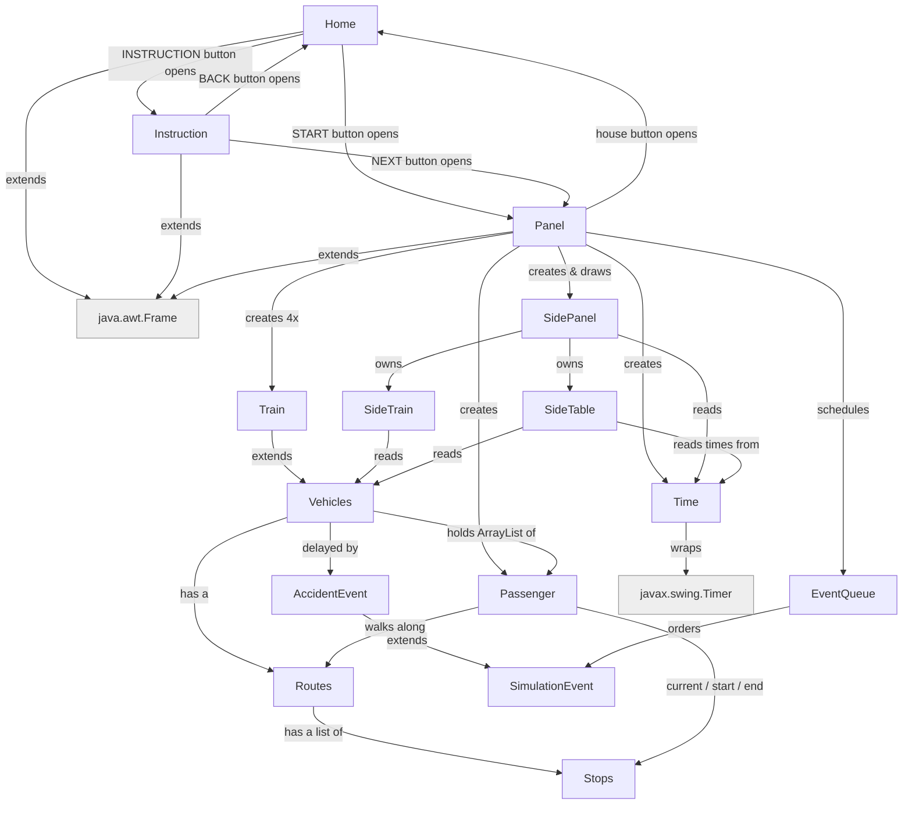

# comp2000-simulation project

The team name: OOPP The GOOP

The team members: Ashton, Luke, Daniel, Minying, Amanda

### Project Goal
The project goal is to build a train simulation.

## Getting Started

How to start the simulation:

1. Run `Home.java`. This opens the home screen.
2. Click START to go straight to the simulation, or INSTRUCTION to read the
   controls first (then click NEXT there to reach the simulation).
3. In the simulation, press space (or the play button, top right) to start
   the clock.
4. Click the house button (top right) at any time to return to the home screen.

## How the classes link




## FlowChart 


This explain each Class do


Plain-text version:

```
Home (title screen) -> START -> Panel, or -> INSTRUCTION -> Instruction -> NEXT -> Panel
Instruction -> BACK -> Home
Panel -> house button -> Home

Panel (the window + game loop)
 ├─ SidePanel: draws the top bar (Time|Day box, house + pause buttons) and
 │             switches between two views with the chevron tabs on the right:
 │   ├─ SideTrain: scrolling list of trains, hover scrollbar
 │   └─ SideTable: wide timetable - one row per train (line, current stop,
 │                 time now, next stop, ETA)
 ├─ Time: 1 real sec = 5 ticks (trains step once per real sec); each real sec also
 │        jumps the clock ~5 sim minutes (+/-15s random) and reports date + 12h time
 ├─ EventQueue<SimulationEvent>: holds scheduled AccidentEvents; each one delays
 │        a named train, shown as a yellow/red hazard border on its card and map icon
 ├─ Passenger: a commuter moving stop to stop
 └─ Train  ── extends ──> Vehicles
                          ├─ Routes: ordered list of Stops for one line
                          │   └─ Stops: a single station (x, y, name)
                          └─ ArrayList<Passenger>  who is on board
```

## Folder Structure

The workspace contains two folders by default, where:

- `src`: the folder to maintain sources
- `lib`: the folder to maintain dependencies

Meanwhile, the compiled output files will be generated in the `bin` folder by default.

> If you want to customize the folder structure, open `.vscode/settings.json` and update the related settings there.


## Project status and next steps

Status labels (plain text): DONE / PARTLY DONE / TODO / IDEA

### Core features

1. Top panel - DONE
   - Top bar shows the simulated clock (12-hour, AM/PM) and the date.
   - Pause / continue button (also toggled with space) and a house button that returns to the home screen.

2. Left panel (SideTrain) - PARTLY DONE
   - Left panel with one card per train: line, current stop, next stop, time and ETA.
   - Scrolling list with a hover scrollbar.
   - Still to do: show passenger counts (number waiting, number on each train).

3. Train time table (SideTable) - DONE
   - Separate wide view with one row per train (line, current stop, time, next stop, ETA).
   - Switched with the two tabs on the right ("Train current" / "Train table").
   - "Busiest right now" footer.
   - Still to do: a real per-stop schedule instead of a flat "+3 min between stops" estimate.

4. Time - DONE
   - 1 real second = 5 ticks; trains step once per real second.
   - Each real second the clock jumps about 5 simulated minutes, with a small random wobble so the seconds look realistic.
   - Format is HH:MM:SS AM/PM plus weekday and date.

5. Accidents / delays - DONE
   - A few random accidents are scheduled per run (EventQueue<SimulationEvent> of AccidentEvents); each stops one train at its current stop for a few steps.
   - A delayed train shows a yellow/red hazard-stripe border, both on its side-panel card and its map icon.
   - Still to do: a replacement bus / metro option instead of just waiting out the delay.

6. Random passengers - PARTLY DONE
   - A passenger already picks a random start and end stop on one line.
   - Still to do: spawn more passengers at rush hour (e.g. 8-9am students and workers), and show min/max on a small graph or table.

7. Passenger types with colour - TODO
   - student = orange, worker = another colour, etc.
   - Small colour key at the top of the side panel.

8. Exceptions - DONE
   - Custom `SimulationTimeException` (checked), thrown by `Time.advance()` when the clock would leave the 06:00 AM - 12:00 PM service window.
   - Caught in `Panel`'s tick loop so the end of service freezes the clock cleanly instead of crashing the window.

9. Instruction / help screen - DONE
   - A `Home` title screen (START / INSTRUCTION) and an `Instruction` screen (BACK / NEXT) explaining the goal and the controls.

10. Clickable stations - TODO
    - Click a station to see how many passengers are waiting and the next train.

## New ideas that can be added


#### Generics
- Done: `EventQueue<T extends SimulationEvent>` (wraps a `PriorityQueue<T>`) schedules accidents; `Pair<T, U>` bundles a label + value for timetable/card rows.
- Still an idea: more event types on top of `SimulationEvent` (e.g. rush hour, a scheduled arrival) once passenger spawning supports it.

#### Exceptions
- Done: `SimulationTimeException` (custom, checked) for the 06:00 AM - 12:00 PM service window, caught in the tick loop.
- Still an idea: `RouteNotFoundException` (stop not on the line) and `TrainFullException` (boarding a full train).

#### Collections
- A Map<String, Train> for looking trains up by name, or Map<Stops, List<Passenger>> for who is waiting at each station.
- A queue of passengers at each station (first in, first on).

### UI Design 

#### Simulation depth
- Enforce train capacity: a full train skips boarding and passengers wait for the next one.
- Use Stops.checkCapacity() so busy stations take longer to board.
- Statistics view: passengers delivered, average wait time, on-time percentage.
- Rush-hour spawn curve tied to the clock.
- Speed control (1x / 2x / 4x) next to pause.
- Day/night background tint from the simulated clock.

UI and usability
- Zoom the map with the mouse wheel when the pointer is over the map (the wheel currently only scrolls the train list).
- Click a line colour in a legend to highlight that line and fade the others.
- Larger-font toggle.


## Idea for wk7-13

#### Inheritance and polymorphism
- More vehicle types as subclasses of Vehicles: Bus, Tram, Metro, each with its own speed, capacity and draw style. The paint loop already treats them all as Vehicles, so this shows polymorphism cleanly.
- Done: `SimulationEvent` base class with `AccidentEvent` as its first subclass (delays a train). More event types (e.g. one per accident cause below) can extend `SimulationEvent` the same way.

#### Testing and logbook
- JUnit tests for Routes.getNextTowards, Vehicles.moveVehicle (including the bounce at the end of the line), and Time formatting.
- Move station and route data into a text or JSON file instead of hardcoding it in Stops.java and Routes.java.

### Different types of accident for train delay (idea list)

- fire
- rain
- earthquake
- a fatality on the line
- train breakdown
- train collision
- train derailment

### Later / nice to have

- Passenger look - DONE (drawn as an orange dot on the train); could still be improved.
- Train images instead of coloured rectangles.
- Weather effects linked to the accident system.
- Bus that can be added when a train breaks down.