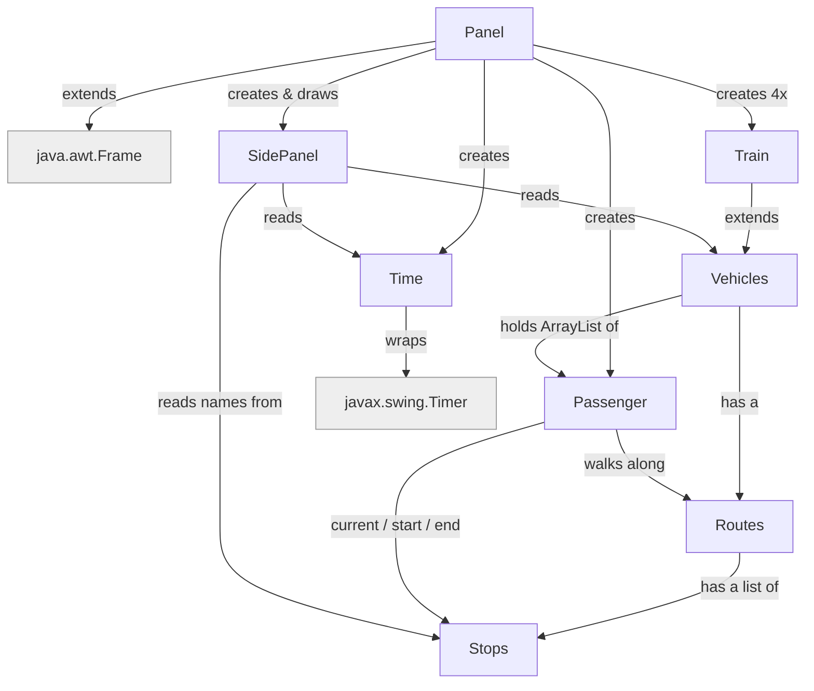

# comp2000-simulation project

The team name: OOPP The GOOP

The team members: Ashton, Luke, Daniel, Minying, Amanda

### Project Goal
Project goal is to have train simulation 

## Getting Started

How to start simulated

1. run the code
2. press space to start simulated

## How the classes link




## FlowChart 


This explain each Class do


Plain-text version:

```
Panel (the window + game loop)
 ├─ SidePanel: draws the top bar (date + AM/PM clock + pause) and a
 │             3-card scrolling list of trains; the grey scrollbar (track + thumb)
 │             appears when the mouse is near the side and lights up on hover/drag
 ├─ Time: 1 real sec = 5 ticks (trains step once per real sec); each real sec also
 │        jumps the clock ~5 sim minutes (+/-15s random) and reports date + 12h time
 ├─ Passenger: a commuter moving stop to stop
 └─ Train  ── extends ──> Vehicles
                          ├─ Routes: ordered list of Stops for one line
                          │   └─ Stops: a single station (x, y, name)
                          └─ ArrayList<Passenger>  who is on board


```

## Folder Structure

The workspace contains two folders by default, where:

- `src`: the folder to maintain sources
- `lib`: the folder to maintain dependencies

Meanwhile, the compiled output files will be generated in the `bin` folder by default.

> If you want to customize the folder structure, open `.vscode/settings.json` and update the related settings there.


## Goal to be done

Some ideas

1. topPanel - done
- add a side bar/panel display on top of screen, this side bar/panel will display the time, 
- add and finish pause and continue buttons
        
2. left panel - need more improve
- then add a left side bar/panel display on the left of the screen
- listing the number of passengers and the number of passengers on the train 
- eg: g.drawString("Passengers: " + passengers.size(), 40, 190);
- g.drawString("On Train: " + train1.getPassengers().size(), 40, 210);
- add a scrow panel 

3. table of train line - need to wait until the station name to be done
- set a point for the train 
- eg Start point for t1, and when it reach to the end
- eg link with the left panel display the time when the train is at a certain station

4. Time issues 
- which need to link with the train time table after 3 being done
- Fix time display to show the time in the format of HH:MM

5. accident issues - link to the 3. table 
- for later accident time later
- eg T1 accident at Station 3, result a stop of the train for 5 minutes, and then continue to move after 5 minutes
- or a replaceable bus or other solution for the passage
    - bus (alot work which new route, panel need to design, splite from train) 
    - metro
        
6. Random passage - link to the 3. time table
- Which set at poit eg 9am alot of students, worker
- add graph? table one the flowchart of passage max/min?

7. Passage - type with colour  
- student: oranger
- work: ... (need to continue)
- add an table at top of side paneel top of t1 display
- but it can be really colour full - mes
    
8. Exceptions - need to be added
- 

9. instrucstion guide 
- open page/main page 
- instrucstion page, explain what is the game for
- link to side panel - which can be open later
    - button display effect

10. stop clickable
- let stop to be click in the later 
- display num passage, next train infor 
 


**different type of accident for train delay**
(feature could be add later on)
- fire
- rain
- earthquake
- someone died
- train breakdown
- train collision
- train derailment
         
### List to be later improve/add

1. looks of 
- passager (probably change another way to display) - done
- train (image?), sidepanel 
2. bus (?can be added once train broke)
3. Weather which link to accident section