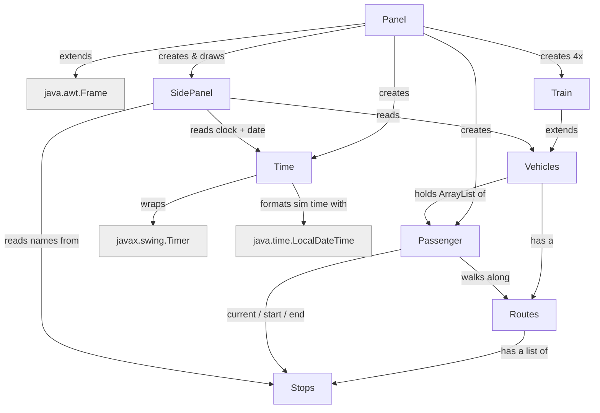

# comp2000-simulation project

The team name: OOPP The GOOP

The team members: Ashton, Luke, Daniel, Minying, Amanda

## Project Goal
Project goal is to have train simulation 

## How the classes link




## FlowChart 


This explain each Class do


Plain-text version:

```
Panel (the window + game loop)
 ├─ SidePanel: draws the top bar (date + AM/PM clock + pause) and a
 │             scrollable list of train cards (mouse wheel or drag the scrollbar)
 ├─ Time: ticking clock (1 real sec = 5 ticks = 1 sim sec), drives every update,
 │        and reports the simulated date + 12-hour clock text
 ├─ Passenger: a commuter moving stop to stop
 └─ Train  ── extends ──▶ Vehicles
                          ├─ Routes: ordered list of Stops for one line
                          │   └─ Stops: a single station (x, y, name)
                          └─ ArrayList<Passenger>  who is on board


