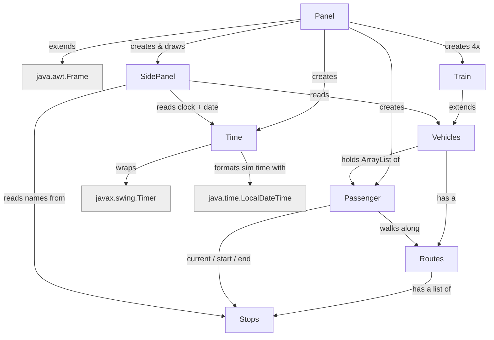

# comp2000-simulation project

The team name: OOPP The GOOP

The team members: Ashton, Luke, Daniel, Minying, Amanda

## Project Goal
Project goal is to have train simulation 

## How the classes link




## FlowChart 


This explain each Class do


Plain-text version:

```


