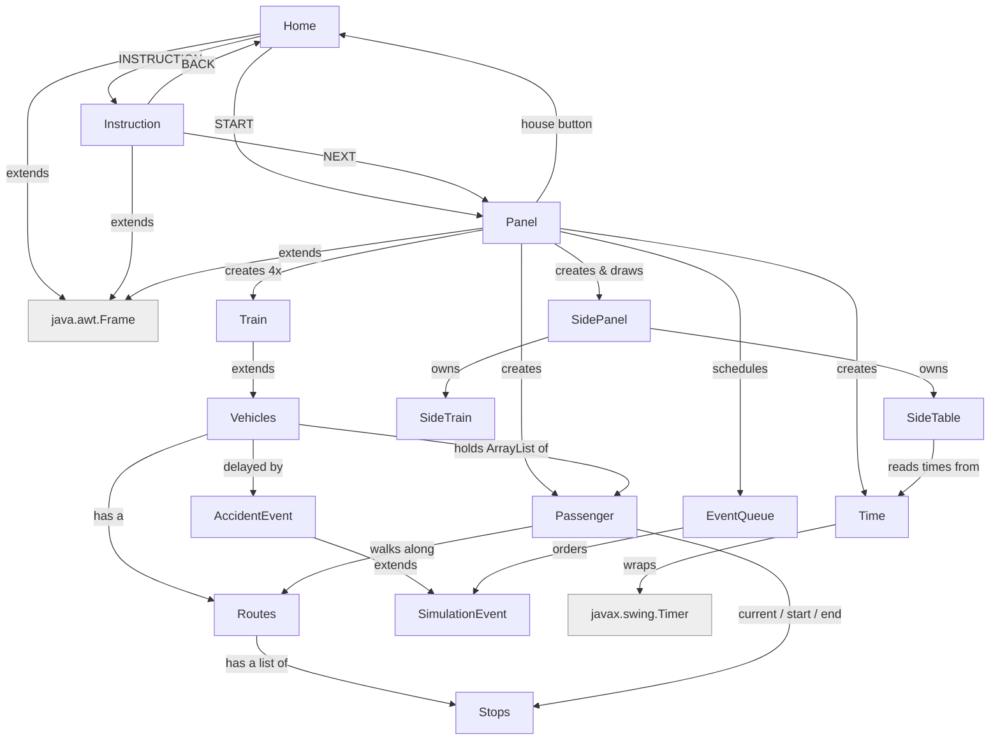

# comp2000-simulation project

COMP2000 S2 2026 Assignment 

Team: OOPP The GOOP: Ashton, Luke, Daniel, Minying, Amanda

## Project Goal

A small transit-network simulation: four trains, each on its own coloured
line, share a station network and carry passengers between stops. Random
accidents delay individual trains mid-route, and the whole timetable runs on
a simulated 06:00 AM to midnight day, resuming automatically each morning.

## Getting Started

1. Run `Home.java`.
2. START opens the simulation directly; INSTRUCTION explains the controls
   first, then NEXT opens it.
3. Space, or the play button (top right), starts/pauses the clock. The house
   button (top right) returns to the home screen.
4. Trains run 06:00 AM – midnight; the clock keeps going overnight and
   service resumes automatically at 6am.

## Folder Structure

- src: the folder to maintain sources
- lib: the folder to maintain dependencies

## Classes

| Class | Role |
|---|---|
| `Home`, `Instruction`, `Panel` | the three screens (title, help, simulation); each `extends Frame` |
| `SidePanel` | top bar (clock, pause, house) and the tabs that switch views |
| `SideTrain` / `SideTable` | scrolling train-card list / timetable view |
| `Vehicles` → `Train` | a vehicle on a route; `Train` adds the `t1()`–`t4()` factories |
| `Routes`, `Stops` | one line's ordered stops; one station |
| `Passenger` | a commuter walking stop to stop |
| `Time` | simulated clock, 06:00–midnight service window, throws on the hour boundary |
| `SimulationEvent` → `AccidentEvent` | a scheduled effect; delays one named train |
| `EventQueue<T extends SimulationEvent>` | priority queue of due events, wraps `PriorityQueue<T>` |
| `Pair<T, U>`, `GenericUtil` | small generics: a label/value pair, a bounded `max(T, T)` |
| `SimulationTimeException` | custom checked exception for the service window |
| `HazardStripe`, `Assets` | drawing helper (delay border); background-picture loader |

## Project Status

Status: DONE / PARTLY DONE / TODO

| Feature | Status | Note |
|---|---|---|
| Top bar | DONE | clock, date, pause, house button |
| Train list (SideTrain) | PARTLY DONE | no passenger-waiting count yet |
| Timetable (SideTable) | DONE | one row per train + "busiest right now" |
| Time | DONE | 06:00–midnight, ~5 sim-min/real-sec, random wobble |
| Accidents / delays | DONE | `EventQueue<AccidentEvent>`, hazard-stripe indicator |
| Random passengers | PARTLY DONE | random start/end; no rush-hour spawn curve |
| Passenger types by colour | TODO | e.g. student/worker colour key |
| Exceptions | DONE | `SimulationTimeException`; image loads fall back instead of crashing |
| Home / Instruction screens | DONE | |
| Clickable stations | TODO | show waiting passengers, next train |

## Ideas for later

- More vehicle types (`Bus`, `Tram`) as further `Vehicles` subclasses.
- More `SimulationEvent` types (rush hour, scheduled arrival) once passenger spawning supports them.
- `RouteNotFoundException`, `TrainFullException`.
- Train capacity limits; `Stops.checkCapacity()` wired into boarding time.
- Statistics view (delivered / average wait / on-time %); speed control (1x/2x/4x); day-night tint.
- Map zoom on scroll; click a line to highlight it; larger-font toggle.
- Station data in a text/JSON file instead of hardcoded in `Stops`/`Routes`.
- JUnit tests for `Routes.getNextTowards`, `Vehicles.moveVehicle`, `Time` formatting.
- More accident causes (fire, weather, breakdown, collision, derailment); a replacement bus while a train is delayed.
- Train images instead of coloured rectangles.

