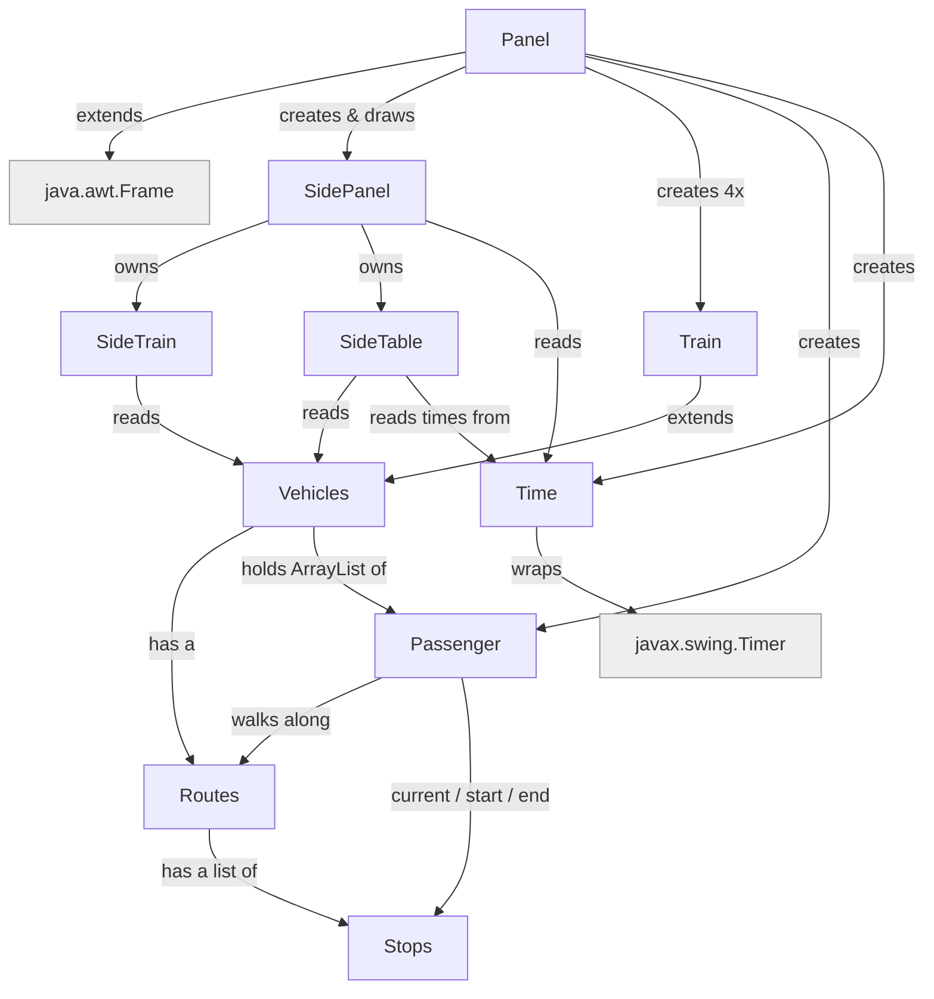

# comp2000-simulation project

The team name: OOPP The GOOP

The team members: Ashton, Luke, Daniel, Minying, Amanda

### Project Goal
The project goal is to build a train simulation.

## Getting Started

How to start the simulation:

1. Run the code (run `Panel.java`).
2. Press space to start the simulation.

## How the classes link




## FlowChart 


This explain each Class do


Plain-text version:

```
Panel (the window + game loop)
 ├─ SidePanel: draws the top bar (Time|Day box, HOME + pause buttons) and
 │             switches between two views with the chevron handles on the right:
 │   ├─ SideTrain: 3-card scrolling list of trains, hover scrollbar; goes dark
 │   │             grey (a collapsed stub) while the timetable is open
 │   └─ SideTable: wide timetable - one row per train (line, current stop,
 │                 time now, next stop, ETA)
 ├─ Time: 1 real sec = 5 ticks (trains step once per real sec); each real sec also
 │        jumps the clock ~5 sim minutes (+/-15s random) and reports date + 12h time
 ├─ Passenger: a commuter moving stop to stop
 └─ Train  ── extends ──> Vehicles
                          ├─ Routes: ordered list of Stops for one line
                          │   └─ Stops: a single station (x, y, name)
                          └─ ArrayList<Passenger>  who is on board


```

## Folder Structure

The workspace contains two folders by default, where:

- `src`: the folder to maintain sources
- `lib`: the folder to maintain dependencies

Meanwhile, the compiled output files will be generated in the `bin` folder by default.

> If you want to customize the folder structure, open `.vscode/settings.json` and update the related settings there.


## Project status and next steps

Status labels (plain text): DONE / PARTLY DONE / TODO / IDEA

### Core features

1. Top panel - DONE
   - Top bar shows the simulated clock (12-hour, AM/PM) and the date.
   - Pause / continue button (also toggled with space).
   - Note: a HOME button was added and then removed; it can come back once it has a purpose.

2. Left panel (SideTrain) - PARTLY DONE
   - Left panel with one card per train: line, current stop, next stop, time and ETA.
   - Scrolling list with a hover scrollbar.
   - Still to do: show passenger counts (number waiting, number on each train).

3. Train time table (SideTable) - DONE
   - Separate wide view with one row per train (line, current stop, time, next stop, ETA).
   - Switched with the two tabs on the right ("Train current" / "Train table").
   - "Busiest right now" footer.
   - Still to do: a real per-stop schedule instead of a flat "+3 min between stops" estimate.

4. Time - DONE
   - 1 real second = 5 ticks; trains step once per real second.
   - Each real second the clock jumps about 5 simulated minutes, with a small random wobble so the seconds look realistic.
   - Format is HH:MM:SS AM/PM plus weekday and date.

5. Accidents / delays - TODO
   - Example: T1 has an accident at a station, stops for 5 minutes, then continues.
   - Options: a delay timer on the train, or a replacement bus / metro on a new route.

6. Random passengers - PARTLY DONE
   - A passenger already picks a random start and end stop on one line.
   - Still to do: spawn more passengers at rush hour (e.g. 8-9am students and workers), and show min/max on a small graph or table.

7. Passenger types with colour - TODO
   - student = orange, worker = another colour, etc.
   - Small colour key at the top of the side panel.

8. Exceptions - TODO
   - Add try/catch and at least one custom exception class (see ideas below).

9. Instruction / help screen - TODO
   - A start screen or overlay explaining what the simulation is and the controls.
   - Could open from a button on the side panel.

10. Clickable stations - TODO
    - Click a station to see how many passengers are waiting and the next train.

### New ideas

Grouped so they also help with the worksheet (design, inheritance, polymorphism, generics, exceptions, testing).

Inheritance and polymorphism
- More vehicle types as subclasses of Vehicles: Bus, Tram, Metro, each with its own speed, capacity and draw style. The paint loop already treats them all as Vehicles, so this shows polymorphism cleanly.
- A Disaster base class with subclasses (Fire, Breakdown, Collision, Weather), each overriding how long it delays a train and how it looks.

Generics
- A generic Schedule<T> or timed EventQueue<T> for future events (accidents, rush hour, an arrival).
- Keep using Pair<T, U> for timetable rows (stop + time), and note every place a generic type is used for the worksheet.

Exceptions
- Custom exceptions: RouteNotFoundException (stop not on the line), TrainFullException (boarding a full train), thrown where they happen and caught in the tick loop so the simulation keeps running.
- Wrap the tick loop in try/catch so one bad frame does not crash the window.

Collections
- A Map<String, Train> for looking trains up by name, or Map<Stops, List<Passenger>> for who is waiting at each station.
- A queue of passengers at each station (first in, first on).

Simulation depth
- Enforce train capacity: a full train skips boarding and passengers wait for the next one.
- Use Stops.checkCapacity() so busy stations take longer to board.
- Statistics view: passengers delivered, average wait time, on-time percentage.
- Rush-hour spawn curve tied to the clock.
- Speed control (1x / 2x / 4x) next to pause.
- Day / night background tint from the simulated clock.

UI and usability
- Zoom the map with the mouse wheel when the pointer is over the map (the wheel currently only scrolls the train list).
- Click a line colour in a legend to highlight that line and fade the others.
- Larger-font toggle.

Testing and logbook
- JUnit tests for Routes.getNextTowards, Vehicles.moveVehicle (including the bounce at the end of the line), and Time formatting.
- Move station and route data into a text or JSON file instead of hardcoding it in Stops.java and Routes.java.

### Different types of accident for train delay (idea list)

- fire
- rain
- earthquake
- a fatality on the line
- train breakdown
- train collision
- train derailment

### Later / nice to have

- Passenger look - DONE (drawn as an orange dot on the train); could still be improved.
- Train images instead of coloured rectangles.
- Weather effects linked to the accident system.
- Bus that can be added when a train breaks down.